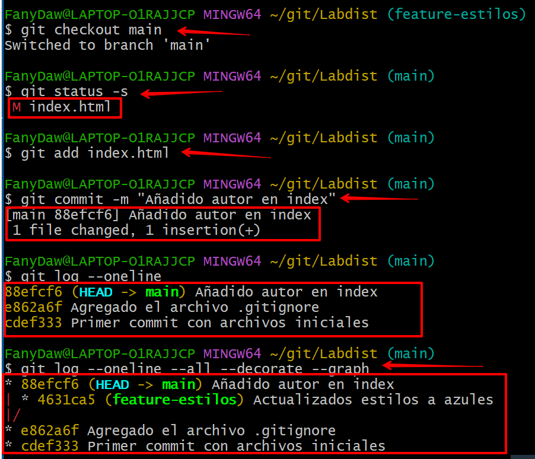

# Ejercicio de Git - proyecto labdist

> Documento realizado por **Epifanía Peralta López** para Despliegue de Aplicaciones Web- distancia

[TOC]

## Trabajo en local

> Esta parte se realiza con comandos.

### Cuestión 1

Inicializa un nuevo repositorio Git en una carpeta llamada `"labdist"` y agrega los archivos proporcionados en el aula virtual. Renombra la rama master a `main`, si es necesario. Realiza el primer commit. Muestra el log del repositorio.


Primeramente abro GitBash desde la carpeta Labdist y compruebo mi user.name y user.email:


Mi editor de textos por defecto es el VSCode.

Como se indica en el enunciado, antes de comenzar el trabajo, escribo el comando para que el historial de ramas de Git se mantenga como un árbol:

```bash
git config --global merge.ff false
git config --global -e	//para verificar que tengo los archivos 							en la carpeta
git init		//para inicializar el repositorio	
git add .		//para indicar los archivos que quiero seguir
git status -s	//me indica lo que hay en el staging area
git commit -m "Primer commit con archivos iniciales"
git log --oneline	
```


En GitBash:


El primer commit y el log:


### Cuestion 2

Incluye un fichero `.gitignore` para que los ficheros `README.md`, `LICENSE.txt` y `passwords.txt` sean ignorados por el control de versiones. Realiza el commit y muestra los logs del repositorio en una línea.

Lo primero es crear los 3 archivos: README.md, LICENSE.txt y passwords.txt. Lo realizo en el explorador de Windows.


También he creado el archivo `.gitignore` en el VSCode e incorporo esos 3 archivos para que sean ignorados por el control de versiones.


Incluyo los archivos en el VSCode:


```bash
git status -s
git add .gitignore
git commit -m "Agregado el archivo .gitignore"
git log --oneline
```


### Cuestion 3

En el repositorio, crea los archivos `README.md`, `LICENSE.txt` y `passwords.txt` con algún contenido. Muestra el estado del repositorio. Muestra el estado de archivos ignorados.


Creo contenido en los 3 archivos indicados:


Para mostrar el estado del repositorio y el listado de archivos ignorados:

```bash
git status -s
git cat .gitignore
```

En `git status -s` no sale nada ya que ese archivo y su contenido he indicado que precisamente no sea controlado por **Git**.

Como `.gitignore` es un archivo, hice un `cat` para que me muestre lo que contiene.


También con:

```bash
git ls-files --other --ignored --exclude-standard
```


### Cuestión 4

Crea una rama `feature-estilos`. Cámbiate a ella.

* Modifica el archivo `estilos.css`:
  * propiedad color del `body` y de `h2`:`#2a2a2a`
  * propiedad `background-color` de `header`y `footer: #2a75ff`
* Comprueba el estado del repositorio. Añade los cambios, realiza un commit con el mensaje "actualizados estilos a azules"


Bien, en este punto me he dado cuenta que no cambié el nombre a `master`:

```bash
git branch -m main
```


Para crear la rama `feature-estilos` y cambiarme a ella:

```bash
git branch feature-estilos
git checkout feature-estilos
//realizo los cambios en el archivo CSS
git status -s		//para ver los cambios en el repositorio
git add .
git commit -m "Actualizados estilos a azules"
```


En el CSS:


En GitBash:


### Cuestión 5

Vuelve a la rama `main`. En el archivo `index.html` añade un comentario donde se indique tu nombre como autor de la página. Comprueba el estado del repositorio. Añade los cambios, realiza un commit con el mensaje 'añadido autor en index'. Muestra los logs del repositorio en una línea, gráficamente y con 'decoración'


```bash
git checkout main
//añado un comentario en el index.html con mi nombre como autor
git status -s
git add index.html
git commit -m "Añadido autor en index"
git log --oneline --all --decorate --graph
```


En `index.html`:


En GitBash:




### Cuestión 6

Fusiona la rama `feature-estilos` en la rama `main`. Muestra los logs del repositorio en una línea, gráficamente y con decoración.

```bash
git merge feature-estilos	//ya estaba en la main
git log --oneline --all --decorate --graph
```


En GitBash:


## Trabajo en remoto

> Esta parte se realizará con la herramienta gráfica ***Sourcetree*** y con ***GitHub***.

Primeramente compruebo que la opciones de SourceTree estén de la siguiente forma:


### Cuestión 1

Continúa con el repositorio `labdist`. Añade el repositorio a **SourceTree**.

En SourceTree, añado el repositorio:


Y el resultado es éste:


### Cuestión 2

En tu cuenta de GitHub, crea un repositorio remoto y sube al remoto los ficheros de tu repositorio local. Debes subir <u>todas</u> las ramas. Muestra, además, la captura de pantalla donde se vean en GitHub.


En mi cuenta de GitHub creé un nuevo repositorio llamado **Labdist**.

En **SourceTree** configuré el repositorio para que se vinculara:


Y subo todas las ramas:


Compruebo en GitHub que han subido las 2 ramas:


### Cuestión 3

No existe: salto a la número 4.

### Cuestión 4

En el repositorio <u>local</u>, crea una rama `feature-index`. Añade el siguiente código dentro de la `<section class="about">`. Añade los cambios y crea un commit con el mensaje "Añadido párrafo equipo en index.html". Sube los cambios al remoto. (Recuerda que debes usar el SourceTree en todo este apartado).


El código a añadir dentro de la section indicada es el sg:


Me encuentro en la rama **main** en el **SourceTree** y desde ahí creo la rama `feature-index`. Dejo marcado **Checkout New Branch**, para ya quedarme en esa rama:


Una vez que incorporé el texto a `index.html` en VSCode, al volver a SourceTree, me aparece:


Y el archivo figura en el Unstaged area:


Le doy al símbolo + y los cambios pasan al Staging area:


Para hacer el commit, simplemente en el workspace, aparece abajo una zona para escribir el mensaje.


Subo los cambios al remoto:


En GitHub compruebo que ha subido la nueva rama:


### Cuestión 5

En el repositorio local, fusiona la rama `feature-index` en la rama `main`.


Aquí me parece que el ejercicio anterior algo no funcionó.

* borró la rama en GitHub:


* renombro la rama a `feature-index` que la había escrito antes mal.

* Subo los cambios a GitHub


  En GitHub compruebo que el cambio en el `index.html` se realizó en la rama correcta: `feature-index`.

Fusiono entonces en el repo local con el SourceTree la rama `feature-index` en la rama `main`.


### Cuestion 6

Edita el fichero `contacto.html`. Borra unas líneas. Muestra los ficheros con cambios pendientes y las diferencias. Añade los cambios y haz un commit.


Añado los cambios y realizo un commit:


### Cuestión 7

Te das cuenta del error. Deshaz TOTALMENTE el commit anterior. Captura el estado actual del repositorio. (Asegúrate de que el fichero `contacto.html` ha recuperado todas las líneas borradas y no hay cambios pendientes en el repositorio.)


En el workspace --> history, hago click-dcho sobre el último commit que quiero deshacer:


Y ahora hago un **Reverse hunk**:


### Cuestión 8

Crea una rama `feature-mapa` y cámbiate a ella. Incluye este código en el archivo `contacto.html`. Añade los cambios. Realiza un commit.


Una vez añadido código en VSCode del archivo `contacto.html`, en el **SourceTree** se muestra así:


Añado los cambios:


Y realizo un commit.

El resultado es el siguiente:


### Cuestión 9

Sube los cambios al remoto -los de todas las ramas. Muestra en el remoto los cambios del archivo `contacto.html` en la rama `feature-mapa`.


En el remoto:


### Cuestión 10

En GitHub, en la rama `main`, fusiona la rama `feature-mapa`. Baja los cambios del remoto a local. Deja los dos repositorios sincronizados. Muestra una captura de pantalla donde se vea la página principal de tu repositorio remoto.


En GitHub se hace con **Pull requests** y **New pull request**:

En el desplegable **base** se indica la rama `main`.

En el desplegable **compare** se indica la rama `feature-mapa`.


Y en **Open a pull request**, ya me indica **Able to merge**:


Para bajar los cambios del remoto al local, hago un pull desde el SourceTree:


Y así es como queda:

* en GitHub:


* en SourceTree:


## Conflictos

> Esta parte se realiza con SourceTree y GitHub.

### Cuestión 1

<u>Enunciado:</u>

Crea una rama `hotfix-js`. Cámbiate a ella. Añade este código en el fichero `script.js`.

```javascript
if (mensaje.value.trim() === "") {
			alert("Por favor, ingrese un mensaje.");
			valid = false;
		}
```


Confirma el cambio y haz un commit con el mensaje "corregido problema en script.js". (Fíjate en los números de línea de tu editor...)

<u>Solución:</u>

Creo una nueva rama llamada `hotfix-js` y me cambio a ella:


Me aseguro de estar efectivamente en la rama `hotfix-js` para añadir código en el fichero `script.js`:


Fueron añadidas 4 líneas (25-28).

Añado los cambios:


Y realizo el commit con el texto indicado:


### Cuestión 2

<u>Enunciado</u>:

Vuelve a la rama `main`. En el fichero `script.js`en las mismas líneas que en la cuestión anterior, añade el código siguiente.

```javascript
if (mensaje.value.trim() === "") {
			alert("Ingrese un mensaje, por favor.");
			valid = false;
		}
```


Confirma el cambio y haz un commit con el mensaje "corregido problema en script.js rama main".

<u>Solución</u>:

Estoy en la rama `main`:


No tenía cerrado el archivo `script.js` en el VSCode y al volver a él, veo que NO FIGURAN LOS CAMBIOS QUE HICE ANTES porque eran de la otra rama (¡fantástico!).


Entonces añado el texto indicado en el fichero `script.js`, en la misma línea de antes (25-28):


En el SourceTree confirmo el cambio y realizo el commit con el mensaje indicado:


Queda así:


Hasta aquí, no salta ningún conflicto.


### Cuestión 3

<u>Enunciado</u>:

Fusiona la rama `hotfix-js` en `main`. Debe producirse un conflicto. Resuélvelo como consideres oportuno. Cuando termines la resolución del conflicto sube los cambios al remoto.


<u>Solución</u>:

Para fusionar la rama `hotfix-js` en `main`:


Y me sale la siguiente pantalla:


En el pantallazo no sale que en la esquina inferior derecha hay un OK para hacer click.

La ventana se cierra y pasa nada.

Pruebo de esta otra forma: estoy en la rama `main` y hago click-dcho sobre la rama `hotfix-js`; se abre un desplegable y eligo "Merge hotfix-js en main":


Me sale el siguiente aviso:


Al aceptar, aparece la siguiente ventana:


Cierro la ventana. 

Voy a resolver el conflicto en la línea utilizando el VSCode:


Muy fácil, pulso en "Aceptar cambio actual" y automáticamente corrige el código; guardo y me vuelvo al SourceTree, donde le indico que el conflicto ha sido resuelto:


Y me pide confirmación:


Estoy en este punto:


Hago el commit:


Y ya me figura la fusión de las ramas:


Y, por último, subo los cambios al repo remoto en GitHub:


## Resultado de los ejercicios

* En el SourceTree:


* En GitHub:


## URL en GitHub

[https://github.com/pfany/labdist.git](https://github.com/pfany/labdist.git)


## Enlace al videoclip

[]()

